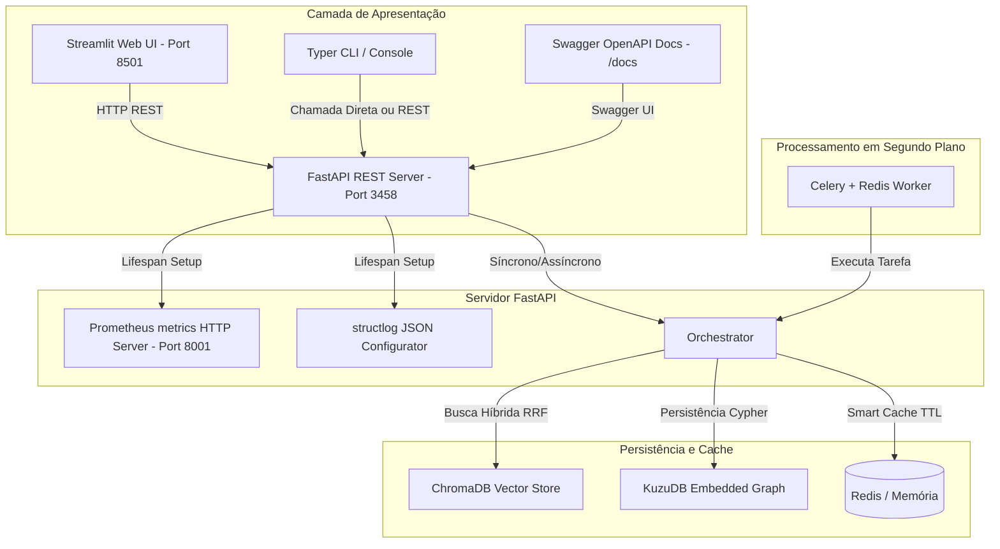

# Smart Research Agent (SRA) v6.0 🚀

O **Smart Research Agent (SRA)** é um ecossistema autônomo de pesquisa inteligente projetado para obter, verificar, persistir e analisar informações técnicas a partir de múltiplas fontes distribuídas (GitHub, HN, Reddit, ArXiv, ProductHunt, Web scraping via Firecrawl e Jina) de forma assíncrona, robusta e resiliente contra bloqueios de rede.

---

## 📐 Arquitetura do Sistema



---

## 🛠️ Configuração e Instalação

### 1. Pré-requisitos
- Python 3.11 ou superior
- Docker & Docker Compose (para Redis, ChromaDB e serviços auxiliares)

### 2. Instalar Dependências Python
```powershell
pip install -r requirements.txt
# Ou instale manualmente as dependências principais:
pip install fastapi uvicorn streamlit typer rich structlog prometheus-client celery redis chromadb rank-bm25 cohere sentence-transformers kuzu
```

### 3. Subir Serviços Auxiliares (Redis, ChromaDB & Auxiliares)
```powershell
docker-compose up -d
```

### 4. Configurar Variáveis de Ambiente (`.env`)
Configure chaves de API, endereços de bancos de dados (Redis, ChromaDB, KuzuDB) e credenciais no arquivo `.env`.

> **Configuração de pesos e fontes (`config/`):** Os arquivos `config/scoring_weights.yaml` e `config/sources.yaml` são **documentação de referência de design** e **NÃO são lidos por nenhum código**. Os pesos reais do ranker híbrido vivem em constantes hardcoded em `src/ranking/hybrid_ranker.py` (`DEFAULT_BM25_WEIGHT`, etc., em `HybridRankerConfig`), e os searchers são instanciados pela `SearcherFactory` (`src/search/factory.py`). Para alterar pesos/fontes reais, edite esses módulos — não estes YAMLs. (Ver `MISSAO_PARTE2_FASE2_CONFIG_E_HITL.md`, Tarefa 2.1 — Opção B.)

---

## 🚀 Como Executar

### 1. API REST FastAPI
Inicie a API REST local com Swagger UI documentado automaticamente:
```powershell
uvicorn api.main:app --port 3458 --reload
```
Acesse a documentação OpenAPI em: [http://localhost:3458/docs](http://localhost:3458/docs)

### 2. Web UI Streamlit
Inicie a interface interativa no seu navegador:
```powershell
streamlit run ui/streamlit_app.py
```
Acesse em: [http://localhost:8501](http://localhost:8501)

### 3. Linha de Comando (CLI Typer)
Execute pesquisas completas de forma ergonômica direto no terminal:
```powershell
# Pesquisa direta
python cli/main.py search "Rust async best practices" --mode guerrilha

# Pesquisa salvando em Markdown
python cli/main.py search "Kubernetes trends 2026" -m cirurgia -o kubernetes.md

# Consultar status dos Circuit Breakers
python cli/main.py status
```

### 4. Celery Worker (Fila Assíncrona)
Inicie o processador de tarefas em segundo plano:
```powershell
celery -A src.worker.celery_app worker --loglevel=info
```

---

## 📡 Observabilidade e Telemetria

- **Métricas Prometheus:** Expostas dinamicamente na porta `8001` no endpoint `/metrics`. Acesse: [http://localhost:8001/metrics](http://localhost:8001/metrics).
- **Logs Estruturados:** Configurados via `structlog` com renderização JSON nativa em produção, otimizada para ingestão automática em Datadog, Grafana Loki, e AWS CloudWatch.

---

## 🔒 Segurança em Produção

A API REST (`api/main.py`) expõe endpoints que consomem tokens de LLM e podem
acionar scraping pago. Por padrão (sem `SRA_API_KEY`), ela roda **sem
autenticação** e com CORS `*` — configuração voltada a desenvolvimento local.
Antes de expor em produção, aplique as três camadas abaixo.

### 1. Autenticação por API Key (`SRA_API_KEY`)

Gere uma chave aleatória e forte:

```powershell
python -c "import secrets; print(secrets.token_urlsafe(32))"
```

Defina no `.env`:

```dotenv
SRA_API_KEY=cole_a_chave_gerada_acima
```

Com `SRA_API_KEY` configurada, todos os endpoints de pesquisa
(`POST /api/research`, `/api/research/async`, `/api/research/stream`) exigem o
header:

```http
X-API-Key: <sua-chave>
```

Requisições sem a chave (ou com chave incorreta) recebem `401 Unauthorized`.
`/health` e `/docs` permanecem abertos. Se `SRA_API_KEY` estiver ausente, um
aviso é emitido no startup e a API roda sem auth (compatibilidade local).

### 2. Restrição de CORS (`CORS_ALLOWED_ORIGINS`)

Em produção, restrinja as origens permitidas às da sua UI real (separadas por
vírgula):

```dotenv
CORS_ALLOWED_ORIGINS=https://seu-app.com,https://app.exemplo.com
```

Deixar `CORS_ALLOWED_ORIGINS=*` (default) permite qualquer origem — aceitável
apenas em dev local.

### 3. Rate Limiting por IP

Os endpoints de pesquisa aplicam rate limiting de **10 requisições/minuto por
IP** (via `slowapi`). Exceder o limite retorna `429 Too Many Requests`. Ajuste
o valor em `api/main.py` (decorador `@limiter.limit(...)`) conforme o custo
esperado por requisição.

### 4. Proxy Reverso (recomendado)

Não exponha o `uvicorn` diretamente. Coloque um proxy reverso (nginx ou Caddy)
à frente para:

- Terminar TLS (HTTPS) e aplicar cabeçalhos de segurança (HSTS, CSP, etc.);
- Fazer autenticação/rate limiting adicionais na borda, se desejado;
- Limitar o bind (evite `0.0.0.0` exposto publicamente sem firewall).

> ⚠️ A configuração padrão (sem `SRA_API_KEY`, CORS `*`) é apenas para
> desenvolvimento local. Nunca a deixe assim em produção.
