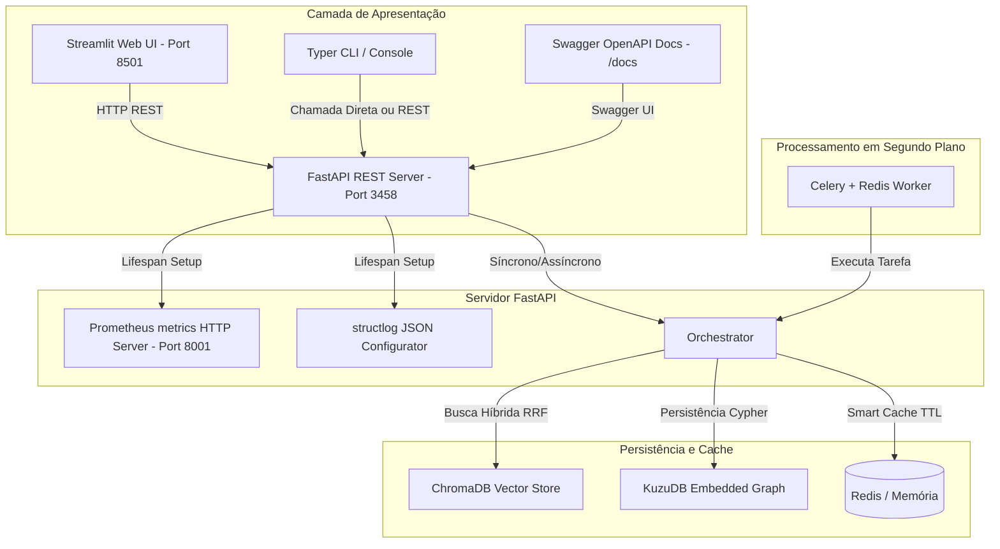

# Smart Research Agent (SRA) v1.0 🚀

O **Smart Research Agent (SRA)** é um ecossistema autônomo de pesquisa inteligente projetado para obter, verificar, persistir e analisar informações técnicas a partir de múltiplas fontes distribuídas (GitHub, HN, Reddit, ArXiv, ProductHunt, Web scraping via Firecrawl e Jina) de forma assíncrona, robusta e resiliente contra bloqueios de rede.

---

## 📐 Arquitetura do Sistema



---

## 🛠️ Configuração e Instalação

### 1. Pré-requisitos
- Python 3.11 ou superior
- Docker & Docker Compose (para Redis, ChromaDB e serviços auxiliares)

### 2. Instalar Dependências Python
```powershell
pip install -r requirements.txt
# Ou instale manualmente as dependências principais:
pip install fastapi uvicorn streamlit typer rich structlog prometheus-client celery redis chromadb rank-bm25 cohere sentence-transformers kuzu
```

### 3. Subir Serviços Auxiliares (Redis, ChromaDB & Auxiliares)
```powershell
docker-compose up -d
```

### 4. Configurar Variáveis de Ambiente (`.env`)
Configure chaves de API, endereços de bancos de dados (Redis, ChromaDB, KuzuDB) e credenciais no arquivo `.env`.

> **Configuração de pesos e fontes (`config/`):** Os arquivos `config/scoring_weights.yaml` e `config/sources.yaml` **são lidos em runtime** por `src/config_loader.py` (`load_scoring_weights()` com cache LRU) e aplicados pelo `HybridRanker` via `_apply_yaml_weights()` em `src/ranking/hybrid_ranker.py`. Para alterar os pesos de ranqueamento, edite `config/scoring_weights.yaml` — não há necessidade de recompilar código.

> **Orquestrador padrão (v7.0+):** A partir da SRA v7.0, o **`ReActOrchestrator`** (loop dinâmico ReAct) é o orquestrador **padrão** — a flag `ENABLE_DYNAMIC_LOOP` tem `default=True`. Ele decide dinamicamente quais etapas do pipeline executar com base no contexto (confiança, lacunas, claims pendentes). Para reverter ao pipeline sequencial clássico (DAG fixo), defina `ENABLE_DYNAMIC_LOOP=false` no `.env`.

---

## 🚀 Como Executar

### 1. Servidor oficial (API REST + MCP)
O servidor oficial de produção é `src/mcp_server.py` — é o que o Dockerfile
sobe e o que expõe tanto as tools MCP quanto as rotas REST. Inicie-o com:
```powershell
uvicorn src.mcp_server:app --port 3458 --reload
```
Acesse a documentação OpenAPI em: [http://localhost:3458/docs](http://localhost:3458/docs)

As rotas REST de pesquisa/agendamento/observabilidade herdadas do módulo
legado `api/main.py` ficam disponíveis sob o prefixo `/api/v2`
(ex.: `POST /api/v2/api/research`), com autenticação `X-API-Key`, CORS por
env (`CORS_ALLOWED_ORIGINS`) e rate limiting por IP aplicados.

> **Legado:** `uvicorn api.main:app --port 3458 --reload` ainda funciona para
> uso standalone da API REST, mas prefira o servidor oficial acima.

### 2. Web UI Streamlit
Inicie a interface interativa no seu navegador:
```powershell
streamlit run ui/streamlit_app.py
```
Acesse em: [http://localhost:8501](http://localhost:8501)

### 3. Linha de Comando (CLI Typer)
Execute pesquisas completas de forma ergonômica direto no terminal:
```powershell
# Pesquisa direta
python cli/main.py search "Rust async best practices" --mode guerrilha

# Pesquisa salvando em Markdown
python cli/main.py search "Kubernetes trends 2026" -m cirurgia -o kubernetes.md

# Consultar status dos Circuit Breakers
python cli/main.py status

# Agendar uma pesquisa recorrente com alertas de mudança (webhook Slack/Discord)
python cli/main.py schedule "novidades em RAG" --cron "0 8 * * *" --webhook "https://hooks.slack.com/..."

# Listar / executar / cancelar pesquisas agendadas
python cli/main.py schedule-list
python cli/main.py schedule-run <job_id>
python cli/main.py schedule-cancel <job_id>
```

> As mesmas operações estão disponíveis via API REST: `POST /api/schedule`,
> `GET /api/schedule` e `DELETE /api/schedule/{job_id}`.

### 4. Celery Worker (Fila Assíncrona)
Inicie o processador de tarefas em segundo plano:
```powershell
celery -A src.worker.celery_app worker --loglevel=info
```

---

## 📡 Observabilidade e Telemetria

- **Métricas Prometheus:** Expostas dinamicamente na porta `8001` no endpoint `/metrics`. Acesse: [http://localhost:8001/metrics](http://localhost:8001/metrics).
- **Logs Estruturados:** Configurados via `structlog` com renderização JSON nativa em produção, otimizada para ingestão automática em Datadog, Grafana Loki, e AWS CloudWatch.

---

## 🧩 Adicionando novas fontes via YAML

O SRA é um **canivete suíço universal**: adicionar uma nova fonte de busca é
uma questão de **YAML, não de código Python**. O `GenericAPISearcher`
(`src/search/generic_api_searcher.py`) lê o catálogo
`config/generic_sources.yaml` em runtime e transforma qualquer API REST pública
em uma fonte de busca — ela é registrada automaticamente no `SearcherFactory` e
validada pelo teste de wiring.

### Exemplo — adicionar uma nova fonte

Basta acrescentar uma entrada em `config/generic_sources.yaml`:

```yaml
sources:
  - id: "openalex"                              # vira o nome do searcher
    name: "OpenAlex (Scholarly Works)"
    base_url: "https://api.openalex.org/works"
    query_param: "search"                       # ?search=<query>. Use null p/ query na URL
    result_path: "results"                      # JMESPath da lista de resultados
    title_field: "title"                        # campo do título (aceita aninhado: bibjson.title)
    url_template: "{id}"                         # {campo} é substituído por item["campo"]
    snippet_field: "doi"                         # campo da descrição/snippet
    max_results: 10
    timeout: 20
    headers:                                     # opcional
      Authorization: "Bearer {OPENALEX_API_KEY}" # {ENV_VAR} resolvido de os.environ
    extra_params:                                # opcional — params fixos
      mailto: "you@example.com"
```

**Campos:**

| Campo | Obrigatório | Descrição |
|---|---|---|
| `id` | ✅ | Identificador único (vira o nome do searcher) |
| `base_url` | ✅ | Endpoint da API. Pode conter `{query}` quando `query_param: null` |
| `result_path` | ✅ | Expressão JMESPath da lista de resultados. `null` = resposta é lista raiz |
| `query_param` | — | Nome do parâmetro de query (ex: `q`). `null` = query interpolada na URL |
| `title_field` / `snippet_field` | — | Campos JMESPath (suportam caminho aninhado, ex: `bibjson.title`) |
| `url_template` | — | Template da URL do resultado; `{campo}` = `item["campo"]` |
| `max_results` / `timeout` | — | Defaults: 10 resultados, 15s |
| `headers` / `extra_params` | — | Headers com `{ENV_VAR}` e parâmetros fixos de query |

Depois, opcionalmente, referencie o `id` da fonte em `config/domains.yaml`
(listas `primary`/`secondary`) para incluí-la no roteamento de um domínio.
Nenhum código Python novo é necessário.

### Busca universal via MCP

A tool MCP `search_anything(query, hint_domain=None, max_results=10)` faz uma
busca multi-fonte cobrindo todas as fontes disponíveis (incluindo as genéricas),
sem precisar conhecer a taxonomia interna do SRA.

### Operadores de busca avançada

A query aceita operadores estilo Google, extraídos automaticamente e aplicados
pelas fontes que os suportam (SearXNG, DuckDuckGo):

```
site:reddit.com melhor teclado mecânico
filetype:pdf machine learning
intitle:python tutorial
```

---

## 🔒 Segurança em Produção

A API REST (`api/main.py`) expõe endpoints que consomem tokens de LLM e podem
acionar scraping pago. Por padrão (sem `SRA_API_KEY`), ela roda **sem
autenticação** e com CORS `*` — configuração voltada a desenvolvimento local.
Antes de expor em produção, aplique as três camadas abaixo.

### 1. Autenticação por API Key (`SRA_API_KEY`)

Gere uma chave aleatória e forte:

```powershell
python -c "import secrets; print(secrets.token_urlsafe(32))"
```

Defina no `.env`:

```dotenv
SRA_API_KEY=cole_a_chave_gerada_acima
```

Com `SRA_API_KEY` configurada, todos os endpoints de pesquisa
(`POST /api/research`, `/api/research/async`, `/api/research/stream`) exigem o
header:

```http
X-API-Key: <sua-chave>
```

Requisições sem a chave (ou com chave incorreta) recebem `401 Unauthorized`.
`/health` e `/docs` permanecem abertos. Se `SRA_API_KEY` estiver ausente, um
aviso é emitido no startup e a API roda sem auth (compatibilidade local).

### 2. Restrição de CORS (`CORS_ALLOWED_ORIGINS`)

Em produção, restrinja as origens permitidas às da sua UI real (separadas por
vírgula):

```dotenv
CORS_ALLOWED_ORIGINS=https://seu-app.com,https://app.exemplo.com
```

Deixar `CORS_ALLOWED_ORIGINS=*` (default) permite qualquer origem — aceitável
apenas em dev local.

### 3. Rate Limiting por IP

Os endpoints de pesquisa aplicam rate limiting via `slowapi`. O limite padrão
é **10 requisições/minuto por IP**. Ajuste o valor via variável de ambiente
`SRA_RATE_LIMIT` (formato slowapi):

```dotenv
SRA_RATE_LIMIT=10/minute   # padrão
SRA_RATE_LIMIT=100/hour   # para uso mais pesado
```

Exceder o limite retorna `429 Too Many Requests`.

### 4. Proxy Reverso (recomendado)

Não exponha o `uvicorn` diretamente. Coloque um proxy reverso (nginx ou Caddy)
à frente para:

- Terminar TLS (HTTPS) e aplicar cabeçalhos de segurança (HSTS, CSP, etc.);
- Fazer autenticação/rate limiting adicionais na borda, se desejado;
- Limitar o bind (evite `0.0.0.0` exposto publicamente sem firewall).

> ⚠️ A configuração padrão (sem `SRA_API_KEY`, CORS `*`) é apenas para
> desenvolvimento local. Nunca a deixe assim em produção.

### 5. Deploy em Produção

Para produção, configure as variáveis de ambiente abaixo. O processo
**recusa a inicialização** (`SystemExit`) se `SRA_ENV=production` e
`SRA_API_KEY` estiver ausente ou se `CORS_ALLOWED_ORIGINS` contiver `*`:

| Variável | Produção | Descrição |
|---|---|---|
| `SRA_ENV` | `production` | Ativa fail-fast security checks. |
| `SRA_API_KEY` | **obrigatório** | Gere com `python -c "import secrets; print(secrets.token_urlsafe(32))"`. |
| `CORS_ALLOWED_ORIGINS` | lista explícita | Ex: `https://app.exemplo.com,https://admin.exemplo.com`. Nunca `*`. |
| `REDIS_PASSWORD` | **obrigatório** | Protege o serviço Redis via Docker Compose. |
| `GRAFANA_ADMIN_PASSWORD` | **obrigatório** | Substitui o default `admin`. |

**Injeção via segredos do Docker:** use `env_file` ou `--env-file` com um
arquivo `.env.production` mantido fora do repositório (já no `.gitignore`).
Para Kubernetes, use `Secrets` e mapeie como variáveis de ambiente no `Deployment`.

---

## 🛡️ Resiliência e Transparência de Falhas (MVP de Resiliência)

O SRA foi reforçado para **tornar a falha visível e rastreável** em vez de
engoli-la silenciosamente. Três correções P0 (FEAT-001/002/003) compõem o MVP
de Resiliência:

| Feature | O que resolve | Comportamento |
|---------|---------------|---------------|
| **FEAT-001** — Header defensivo | `GenericAPISearcher` montava `Authorization: Bearer ` (vazio) quando a env var estava ausente, quebrando a requisição com `Illegal header value`. | Headers com env var ausente/vazia são **omitidos** da requisição; 1 `logger.warning` único por source. |
| **FEAT-002** — Sinal de falha na síntese | `generate_structured` retornava fallback mudo quando o LLM vinha vazio/não-JSON, entregando relatório incompleto sem aviso. | `LLMClient` expõe `last_failure`; callers (`report_stage`, `expand_stage`) registram `context.extra["synthesis_warning"]`. Retorno estruturado mantido (sem quebrar parsing). |
| **FEAT-003** — Credencial-aware no `SearchStage` | Fontes sem searcher/credencial sumiam do relatório sem explicação. | `SearchStage` popula `context.extra["search_warnings"]` ("sem searcher" / "sem credencial"); `report_stage` expõe a seção **⚠️ Fontes Não Atendidas** no rodapé do Markdown. |

### Por que importa

Em uso real, o agente "falha graciosamente demais": credencial ausente
(`FIRECRAWL_API_KEY`, `NOTION_API_KEY`), API `401` ou LLM vazio produziam
relatórios incompletos **sem dizer por quê**. Agora, o rodapé do relatório
informa explicitamente quais fontes não foram atendidas e por que — guiando a
correta configuração do `.env`.

Exemplo de rodapé gerado quando `notion` está no plano mas sem credencial:

```markdown
## ⚠️ Fontes Não Atendidas

As seguintes fontes do plano de busca não retornaram resultados por falta de
configuração (credencial ausente ou searcher não registrado):

- Fonte 'notion' no plano não tem searcher registrado (sem credencial/config).
```

### Cobertura de testes

Cada feature tem suite TDD dedicada (`tests/test_generic_api_searcher_headers.py`,
`tests/test_generate_structured_failure.py`, `tests/test_search_stage_credentials.py`),
todas verdes. Nenhuma nova dependência foi adicionada (Regra #5 do CLAUDE.md).
