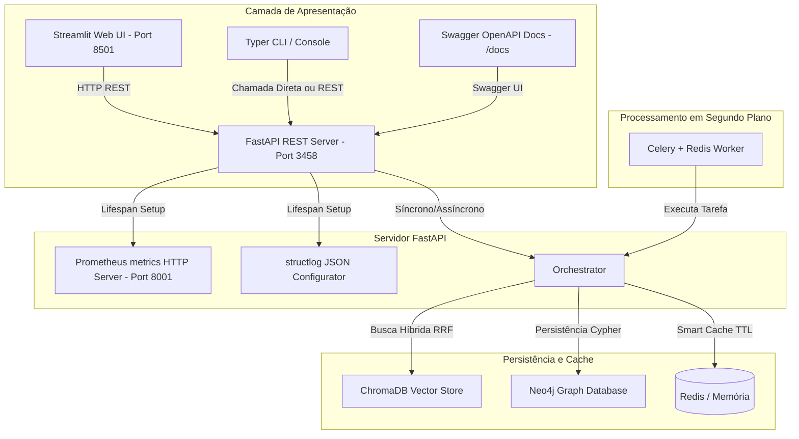

# Smart Research Agent (SRA) v6.0 🚀

O **Smart Research Agent (SRA)** é um ecossistema autônomo de pesquisa inteligente projetado para obter, verificar, persistir e analisar informações técnicas a partir de múltiplas fontes distribuídas (GitHub, HN, Reddit, ArXiv, ProductHunt, Web scraping via Firecrawl e Jina) de forma assíncrona, robusta e resiliente contra bloqueios de rede.

---

## 📐 Arquitetura do Sistema



---

## 🛠️ Configuração e Instalação

### 1. Pré-requisitos
- Python 3.11 ou superior
- Docker & Docker Compose (para Redis e Neo4j)

### 2. Instalar Dependências Python
```powershell
pip install -r requirements.txt
# Ou instale manualmente as dependências principais:
pip install fastapi uvicorn streamlit typer rich structlog prometheus-client celery redis neo4j chromadb rank-bm25 cohere sentence-transformers
```

### 3. Subir Serviços Auxiliares (Redis & Neo4j)
```powershell
docker-compose up -d
```

### 4. Configurar Variáveis de Ambiente (`.env`)
Configure chaves de API, endereços de bancos de dados e credenciais no arquivo `.env`.

---

## 🚀 Como Executar

### 1. API REST FastAPI
Inicie a API REST local com Swagger UI documentado automaticamente:
```powershell
uvicorn api.main:app --port 3458 --reload
```
Acesse a documentação OpenAPI em: [http://localhost:3458/docs](http://localhost:3458/docs)

### 2. Web UI Streamlit
Inicie a interface interativa no seu navegador:
```powershell
streamlit run ui/streamlit_app.py
```
Acesse em: [http://localhost:8501](http://localhost:8501)

### 3. Linha de Comando (CLI Typer)
Execute pesquisas completas de forma ergonômica direto no terminal:
```powershell
# Pesquisa direta
python cli/main.py search "Rust async best practices" --mode guerrilha

# Pesquisa salvando em Markdown
python cli/main.py search "Kubernetes trends 2026" -m cirurgia -o kubernetes.md

# Consultar status dos Circuit Breakers
python cli/main.py status
```

### 4. Celery Worker (Fila Assíncrona)
Inicie o processador de tarefas em segundo plano:
```powershell
celery -A src.worker.celery_app worker --loglevel=info
```

---

## 📡 Observabilidade e Telemetria

- **Métricas Prometheus:** Expostas dinamicamente na porta `8001` no endpoint `/metrics`. Acesse: [http://localhost:8001/metrics](http://localhost:8001/metrics).
- **Logs Estruturados:** Configurados via `structlog` com renderização JSON nativa em produção, otimizada para ingestão automática em Datadog, Grafana Loki, e AWS CloudWatch.
