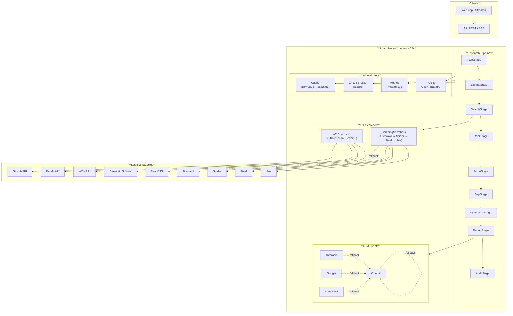
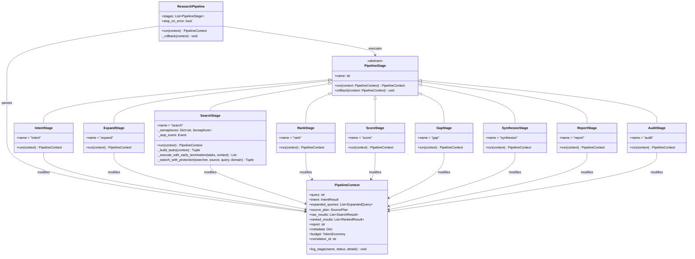
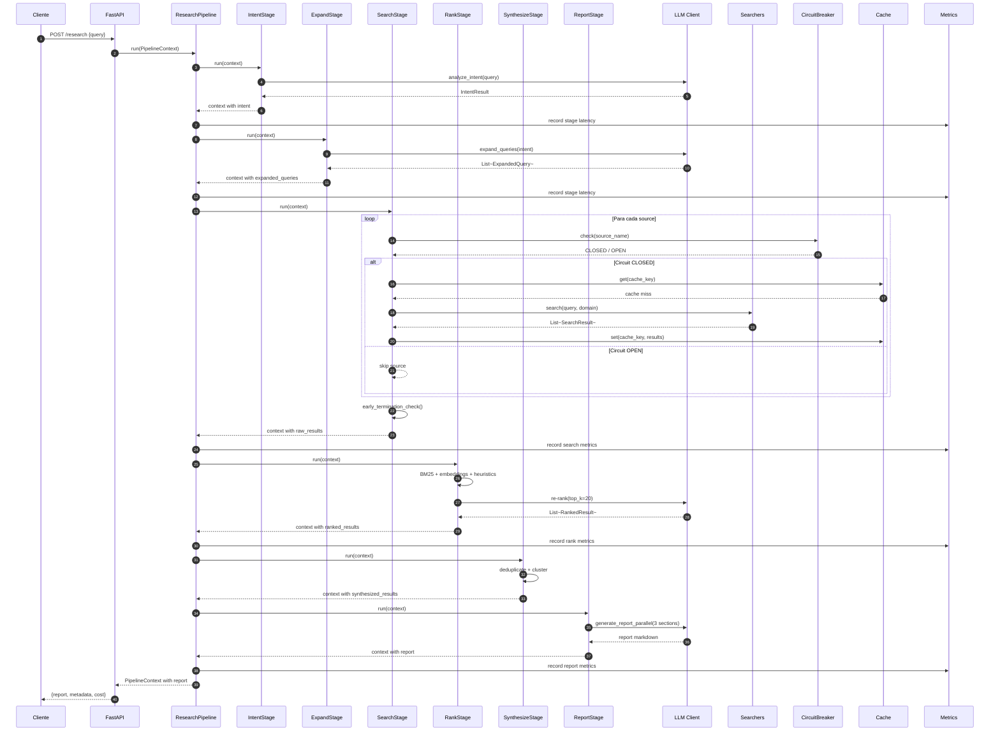
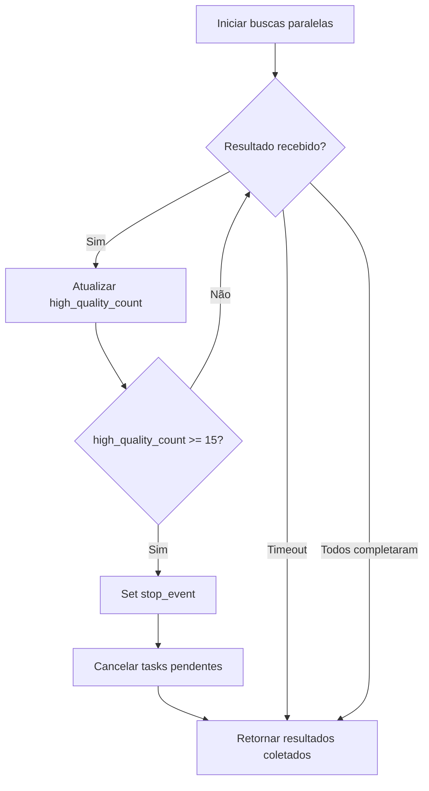
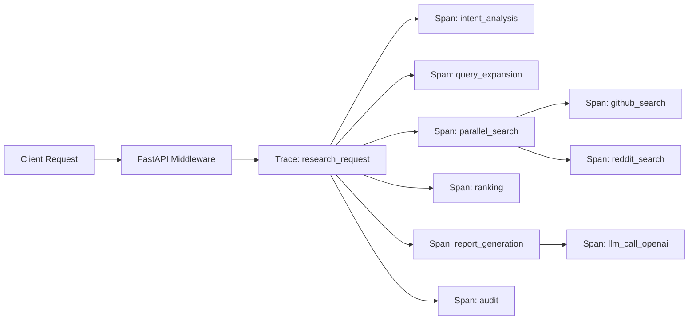

# Arquitetura do Smart Research Agent (SRA) v6.0

> **Versão:** 6.0
> **Atualizado:** 2026-07-04
> **Status:** Em refatoração (Fase 2 — Pipeline Pattern)

---

## Sumário

1. [Visão Geral](#1-visão-geral)
2. [Diagrama de Componentes](#2-diagrama-de-componentes)
3. [Fluxo do Pipeline](#3-fluxo-do-pipeline)
4. [Módulos](#4-módulos)
5. [Decisões de Design (ADRs)](#5-decisões-de-design-adrs)
6. [Integração e Deployment](#6-integração-e-deployment)
7. [Observabilidade](#7-observabilidade)
8. [Roadmap](#8-roadmap)

---

## 1. Visão Geral

O **Smart Research Agent (SRA)** é um sistema de pesquisa inteligente que orquestra múltiplas fontes de dados (APIs, scraping, bases acadêmicas) para produzir relatórios estruturados com alta qualidade e baixo custo.

### Objetivos Arquiteturais

| Objetivo | Métrica Alvo | Status v5.x | Status v6.0 |
|---|---|---|---|
| **Custo** | $0.15–0.60 por pesquisa complexa | $0.50–2.00 | 🔄 Em progresso |
| **Latência** | 30s–2min | 2–5min | 🔄 Em progresso |
| **Chamadas LLM** | 5–8 por pesquisa | 15–20 | 🔄 Em progresso |
| **Nós Deep Research** | ~15 | ~85 | ✅ Implementado |
| **Manutenibilidade** | +40% | — | 🔄 Em progresso |
| **Testabilidade** | +60% | — | 🔄 Em progresso |
| **Observabilidade** | +80% | — | ✅ Implementado |

### Princípios de Design

1. **Separação de Responsabilidades**: Cada stage do pipeline tem uma única responsabilidade
2. **Injeção de Dependências**: Nenhum módulo cria suas próprias dependências
3. **Fail-Fast com Graceful Degradation**: Circuit breakers e fallbacks em cascata
4. **Economia de Tokens**: Cache semântico, early termination, batching
5. **Observabilidade Primeiro**: Métricas Prometheus, tracing distribuído, correlation IDs

---

## 2. Diagrama de Componentes

### 2.1 Visão de Alto Nível



### 2.2 Diagrama de Classes — Pipeline



### 2.3 Diagrama de Sequência — Pesquisa Completa



---

## 3. Fluxo do Pipeline

### 3.1 Stages do Pipeline

| # | Stage | Entrada | Saída | Otimizações v6.0 |
|---|---|---|---|---|
| 1 | **IntentStage** | Query bruta | `IntentResult` + domain classification | Consolidado com query expansion (1 LLM call vs 2) |
| 2 | **ExpandStage** | Intent | `List[ExpandedQuery]` | Cache de expansões similares |
| 3 | **SearchStage** | Expanded queries + source plan | `List[SearchResult]` | Semaphore por source, circuit breaker, early termination |
| 4 | **RankStage** | Raw results | `List[RankedResult]` | Hybrid ranking (BM25 + embeddings + heuristics), só LLM no top-K |
| 5 | **ScoreStage** | Ranked results | `List[RankedResult]` com confidence | Skip scoring para dados estruturados (GitHub API) |
| 6 | **GapStage** | Scored results | `List[Gap]` + re-search se necessário | Budget check, diminishing returns detection |
| 7 | **SynthesizeStage** | All results | `List[SynthesizedResult]` | Embeddings para clusterização semântica, deduplicação fuzzy |
| 8 | **ReportStage** | Synthesized results | Relatório markdown | Paralelização de 3 seções, 1 LLM call com schema JSON |
| 9 | **AuditStage** | Relatório final | Relatório validado | 1 iteração no modo padrão, skip para alta confiança |

### 3.2 PipelineContext — Estado Compartilhado

```python
@dataclass
class PipelineContext:
    # Entrada
    query: str = ""
    enriched_query: str = ""

    # Planejamento
    intent: Optional[IntentResult] = None
    expanded_queries: List[ExpandedQuery] = field(default_factory=list)
    source_plan: Optional[SourcePlan] = None

    # Execução
    raw_results: List[SearchResult] = field(default_factory=list)
    ranked_results: List[RankedResult] = field(default_factory=list)

    # Síntese
    synthesized_results: List[Any] = field(default_factory=list)
    report: str = ""

    # Metadados
    metadata: Dict[str, Any] = field(default_factory=dict)
    budget: Optional[Any] = None
    total_cost_usd: float = 0.0
    correlation_id: str = ""
    stage_logs: List[Dict] = field(default_factory=list)
```

### 3.3 Early Termination no SearchStage



---

## 4. Módulos

### 4.1 Core Pipeline (`src/pipeline/`)

| Arquivo | Responsabilidade | Interface Pública |
|---|---|---|
| `pipeline.py` | Orquestração de stages | `ResearchPipeline`, `PipelineContext`, `PipelineStage` |
| `stage_factory.py` | DI e lazy init de stages | `StageFactory.create_stage()`, `StageFactory.create_pipeline()` |
| `fallback_manager.py` | Fallbacks centralizados | `FallbackManager.register()`, `execute_with_fallback()` |
| `stages/intent_stage.py` | Análise de intent | `IntentStage.run()` |
| `stages/expand_stage.py` | Expansão de queries | `ExpandStage.run()` |
| `stages/search_stage.py` | Busca paralela | `SearchStage.run()` — semaphore, CB, early termination |
| `stages/rank_stage.py` | Ranqueamento | `RankStage.run()` — delega para HybridRanker |
| `stages/score_stage.py` | Confidence scoring | `ScoreStage.run()` — skip para dados estruturados |
| `stages/gap_stage.py` | Detecção de gaps | `GapStage.run()` — budget check, diminishing returns |
| `stages/synthesize_stage.py` | Síntese | `SynthesizeStage.run()` — clusterização semântica |
| `stages/report_stage.py` | Geração de relatório | `ReportStage.run()` — paralelização de seções |
| `stages/audit_stage.py` | Auditoria | `AuditStage.run()` — 1 iteração padrão |

### 4.2 Search (`src/search/`)

| Arquivo | Responsabilidade | Herança |
|---|---|---|
| `base_searcher.py` | Interface base | `BaseSearcher` (ABC) |
| `api_searcher.py` | Base para APIs | `APISearcher(BaseSearcher)` — HTTP client compartilhado |
| `scraping_searcher.py` | Base para scraping | `ScrapingSearcher(BaseSearcher)` — cascade fallback |
| `factory.py` | Criação dinâmica | `SearcherFactory` |
| `github_searcher.py` | GitHub API | `APISearcher` |
| `reddit_searcher.py` | Reddit API | `APISearcher` |
| `arxiv_searcher.py` | arXiv API | `APISearcher` |
| `hackernews_searcher.py` | HN API | `APISearcher` |
| `semantic_scholar_searcher.py` | Semantic Scholar | `APISearcher` |
| `stackoverflow_searcher.py` | StackOverflow | `APISearcher` |
| `pubmed_searcher.py` | PubMed | `APISearcher` |
| `producthunt_searcher.py` | ProductHunt | `APISearcher` |
| `youtube_searcher.py` | YouTube | `APISearcher` |
| `rss_searcher.py` | RSS feeds | `APISearcher` |
| `searxng_searcher.py` | SearXNG | `APISearcher` |
| `web_searcher.py` | Web genérico | `ScrapingSearcher` |
| `firecrawl_searcher.py` | Firecrawl | `ScrapingSearcher` |
| `spider_searcher.py` | Spider | `ScrapingSearcher` |
| `steel_searcher.py` | Steel | `ScrapingSearcher` |
| `jina_searcher.py` | Jina | `ScrapingSearcher` |
| `serpapi_searcher.py` | SerpAPI | `APISearcher` |
| `tavily_searcher.py` | Tavily | `APISearcher` |

### 4.3 Ranking (`src/ranking/`)

| Arquivo | Responsabilidade | Algoritmo |
|---|---|---|
| `hybrid_ranker.py` | Ranking híbrido | BM25 (0.30) + embeddings (0.30) + heurísticas (0.25) + LLM top-K (0.15) |
| `learned_ranker.py` | Ranking com ML | LightGBM/XGBoost com features de BM25, embeddings, freshness, authority |

### 4.4 Infraestrutura (`src/utils/`)

| Arquivo | Responsabilidade | Padrão |
|---|---|---|
| `circuit_breaker.py` | Resiliência | Circuit Breaker (CLOSED/OPEN/HALF_OPEN) |
| `retry.py` | Retentativa | Backoff exponencial + jitter |
| `semantic_cache.py` | Cache inteligente | Similaridade cosseno > 90% + TTL adaptativo |

### 4.5 Observabilidade (`src/monitoring/`)

| Arquivo | Responsabilidade | Formato |
|---|---|---|
| `metrics.py` | Métricas Prometheus | Counters, Histograms, Gauges |
| `tracing.py` | Tracing distribuído | OpenTelemetry + correlation IDs |

### 4.6 API (`src/api/`)

| Arquivo | Responsabilidade | Protocolo |
|---|---|---|
| `fastapi_app.py` | Aplicação FastAPI | REST |
| `streaming.py` | Streaming em tempo real | SSE + WebSocket fallback |

---

## 5. Decisões de Design (ADRs)

### ADR-001: Pipeline Pattern em vez de God Object

**Status:** ✅ Aprovado
**Contexto:** O `Orchestrator` acumulava ~655 linhas violando SRP.
**Decisão:** Decompor em `ResearchPipeline` com stages independentes.
**Consequências:**
- ✅ Testabilidade: cada stage testável isoladamente
- ✅ Extensibilidade: novos stages sem modificar existentes
- ✅ Observabilidade: tracking por stage
- ⚠️ Overhead: contexto compartilhado entre stages

### ADR-002: Hybrid Ranking (BM25 + Embeddings + LLM)

**Status:** ✅ Aprovado
**Contexto:** Ranking puramente por LLM era caro e lento.
**Decisão:** Pipeline de 3 camadas: pre-filter → BM25+embeddings → LLM só no top-K.
**Consequências:**
- ✅ Custo: -70% em chamadas LLM de ranking
- ✅ Latência: pre-filter O(n), BM25 O(n×vocab), LLM só no top-20
- ⚠️ Complexidade: necessita de modelo de embeddings

### ADR-003: Semantic Cache com Embeddings

**Status:** ✅ Aprovado
**Contexto:** Cache key-value não aproveita queries semanticamente similares.
**Decisão:** Cache por similaridade de embeddings (threshold 90%) com TTL adaptativo.
**Consequências:**
- ✅ Hit rate: +30-40% para queries similares
- ✅ TTL adaptativo: GitHub 24h, Reddit 1h
- ⚠️ Custo: embeddings adicionais para cache keys

### ADR-004: Circuit Breaker por Source

**Status:** ✅ Aprovado
**Contexto:** Falhas em APIs externas causavam cascata de timeouts.
**Decisão:** Circuit breaker independente por source (GitHub, Reddit, etc.).
**Consequências:**
- ✅ Resiliência: falha isolada por source
- ✅ Latência: fail-fast quando circuito aberto
- ⚠️ Tuning: thresholds de falha e recovery timeout por source

### ADR-005: Async First com Semaphore por Source

**Status:** ✅ Aprovado
**Contexto:** `asyncio.gather(*tasks)` sem controle causava rate limits.
**Decisão:** Semáforo por source (3-5 concorrentes) + async em todo o pipeline.
**Consequências:**
- ✅ Rate limit compliance
- ✅ Throughput controlado
- ⚠️ Complexidade: gerenciamento de semáforos

### ADR-006: Dependency Injection via Container

**Status:** ✅ Aprovado
**Contexto:** Variáveis globais (`_orchestrator`, `_deep_researcher`) impediam multi-tenancy.
**Decisão:** Container DI com lifecycle (singleton/scoped/transient) + FastAPI app.state.
**Consequências:**
- ✅ Multi-tenancy: múltiplas instâncias com configs diferentes
- ✅ Testabilidade: override de dependências
- ✅ A/B testing: diferentes configs por request
- ⚠️ Complexidade: container e registro de serviços

### ADR-007: Streaming SSE com WebSocket Fallback

**Status:** ✅ Aprovado
**Contexto:** UX ruim com polling ou espera síncrona de 2-5min.
**Decisão:** SSE nativo com WebSocket fallback para clientes não compatíveis.
**Consequências:**
- ✅ UX: progresso em tempo real
- ✅ Eficiência: conexão persistente, sem polling
- ⚠️ Infra: suporte a conexões longas (nginx proxy_buffering off)

### ADR-008: Learned Ranker (LightGBM/XGBoost)

**Status:** 🔄 Em discussão
**Contexto:** Heurísticas estáticas não aprendem com feedback do usuário.
**Decisão:** Ranker treinado offline com feedback histórico, inferência < 10ms.
**Consequências:**
- ✅ Qualidade: +20-30% com feedback
- ✅ Velocidade: inferência rápida
- ⚠️ Dados: necessita feedback store
- ⚠️ Complexidade: pipeline de treinamento

---

## 6. Integração e Deployment

### 6.1 Docker Compose

```yaml
# docker-compose.yml (produção)
services:
  sra:
    build: .
    ports:
      - "8000:8000"  # API REST
      - "8001:8001"  # Métricas Prometheus
    environment:
      - OPENAI_API_KEY=${OPENAI_API_KEY}
      - ANTHROPIC_API_KEY=${ANTHROPIC_API_KEY}
      - GITHUB_TOKEN=${GITHUB_TOKEN}
    depends_on:
      - redis
      - chromadb
      - neo4j
      - searxng

  redis:
    image: redis:7-alpine
    ports: ["6379:6379"]

  chromadb:
    image: chromadb/chroma:latest
    ports: ["8002:8000"]

  neo4j:
    image: neo4j:5
    ports: ["7474:7474", "7687:7687"]

  searxng:
    image: searxng/searxng:latest
    ports: ["8080:8080"]

  prometheus:
    image: prom/prometheus:latest
    ports: ["9090:9090"]
    volumes:
      - ./prometheus.yml:/etc/prometheus/prometheus.yml

  grafana:
    image: grafana/grafana:latest
    ports: ["3000:3000"]
```

### 6.2 Docker Compose Dev (mínimo)

```yaml
# docker-compose.dev.yml
services:
  sra:
    build: .
    ports: ["8000:8000"]
    volumes: [".:/app"]
    environment:
      - SRA_MODE=dev
      - CACHE_TYPE=memory

  searxng:
    image: searxng/searxng:latest
    ports: ["8080:8080"]
```

### 6.3 Variáveis de Ambiente

| Variável | Descrição | Obrigatória |
|---|---|---|
| `OPENAI_API_KEY` | API key OpenAI | Sim (ou alternativa) |
| `ANTHROPIC_API_KEY` | API key Anthropic | Não |
| `GITHUB_TOKEN` | Token GitHub | Não |
| `REDDIT_CLIENT_ID` | Client ID Reddit | Não |
| `REDDIT_CLIENT_SECRET` | Client Secret Reddit | Não |
| `SERPAPI_KEY` | Key SerpAPI | Não |
| `FIRECRAWL_KEY` | Key Firecrawl | Não |
| `SRA_MODE` | Modo: dev, staging, prod | Não (default: dev) |
| `SRA_LOG_LEVEL` | Nível de log | Não (default: INFO) |
| `SRA_METRICS_PORT` | Porta métricas Prometheus | Não (default: 8001) |

---

## 7. Observabilidade

### 7.1 Métricas Prometheus

| Métrica | Tipo | Labels | Descrição |
|---|---|---|---|
| `sra_search_requests_total` | Counter | source, status, domain | Total de buscas |
| `sra_llm_calls_total` | Counter | provider, model, status, task_type | Chamadas LLM |
| `sra_cache_hits_total` | Counter | cache_type, source, hit_type | Hits/misses cache |
| `sra_search_duration_seconds` | Histogram | source, status | Latência de busca |
| `sra_llm_duration_seconds` | Histogram | provider, model, task_type | Latência LLM |
| `sra_active_searchers` | Gauge | source | Searchers ativos |
| `sra_queue_size` | Gauge | queue_type | Tamanho da fila |
| `sra_circuit_breaker_state` | Gauge | source | Estado do CB (0/1/2) |
| `sra_budget_remaining_usd` | Gauge | budget_type | Orçamento restante |

### 7.2 Tracing OpenTelemetry



### 7.3 Dashboards Grafana

- **SRA Overview**: Latência, throughput, taxa de erro por modo
- **Cost Monitor**: Custo por pesquisa, tokens, previsão de orçamento
- **Searchers Health**: Estado dos circuit breakers, rate limits, falhas
- **Pipeline Performance**: Latência por stage, gargalos identificados

---

## 8. Roadmap

### Fase 1: Correções Críticas (✅ Concluída)
- [x] Decompor Orchestrator em Pipeline
- [x] Circuit breaker por source
- [x] Retry com backoff exponencial
- [x] Semantic cache
- [x] Early termination
- [x] Hybrid ranking

### Fase 2: Novos Módulos (🔄 Em Progresso)
- [x] Pipeline stages independentes
- [x] Stage factory com DI
- [x] ScrapingSearcher com cascade
- [x] Métricas Prometheus
- [x] Streaming SSE
- [x] Learned ranker (LightGBM)
- [ ] Cache warming
- [ ] Tracing completo (OpenTelemetry)

### Fase 3: Otimizações Avançadas (📋 Planejada)
- [ ] Fine-tuning de ranker com feedback
- [ ] GraphRAG (Neo4j para knowledge graph)
- [ ] Multi-agent collaboration
- [ ] Auto-optimization de prompts
- [ ] Cold start optimization

---

## Referências

- [README.md](../README.md)
- [CHANGELOG.md](../CHANGELOG.md)
- [DEVELOPMENT.md](DEVELOPMENT.md)
- Repositório: https://github.com/CarlosFrazao/smart-research-agent
